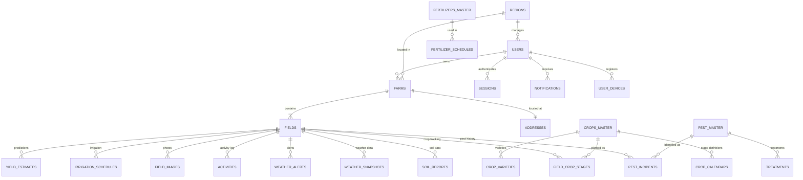

# End-to-End Data Model: Crop-Based Farming Platform

## Comprehensive Database Schema Design

---

## 1. Overview

This document defines the complete data model for the Crop-Based Farming Platform, covering all entities from farmers and farms to crop stages, pest incidents, soil reports, and yield estimates.

### Database: MongoDB 7.x (Atlas)

Key Design Principles:
- **Document-oriented**: Embed related data where appropriate
- **GeoJSON native**: Full support for spatial queries
- **Flexible schema**: Accommodates varying crop and soil parameters
- **Indexing strategy**: Optimized for common query patterns
- **TTL indexes**: Auto-expiry for transient data

---

## 2. Entity Relationship Diagram



---

## 3. Core Entity Collections

### 3.1 Users Collection

> Central user identity and profile management

```typescript
interface User {
  _id: ObjectId;
  
  // Identity
  mobile: string;               // Unique, indexed - e.g., "9876543210"
  email: string;                // Unique, indexed
  name: string;                 // Full name
  avatar?: string;              // S3/Cloudinary URL
  
  // Authentication
  password?: string;            // bcrypt hash (optional - OTP primary)
  mobileVerified: boolean;
  emailVerified: boolean;
  
  // Role & Access
  role: UserRole;               // FARMER, AGRONOMIST, etc.
  status: 'ACTIVE' | 'INACTIVE' | 'SUSPENDED';
  
  // Localization
  language: 'en' | 'hi' | 'te' | 'ta' | 'mr' | 'kn';
  
  // Preferences
  preferences: {
    notifications: {
      email: boolean;
      sms: boolean;
      push: boolean;
    };
    theme: 'light' | 'dark' | 'auto';
    units: {
      temperature: 'celsius' | 'fahrenheit';
      area: 'acres' | 'hectares' | 'bigha';
      rainfall: 'mm' | 'inches';
    };
  };
  
  // Regional Assignment (for non-farmers)
  assignedRegions?: ObjectId[];  // Region IDs
  
  // Metadata
  metadata: {
    lastLoginAt?: Date;
    lastLoginIP?: string;
    loginCount: number;
    registrationSource: 'web' | 'mobile' | 'admin';
  };
  
  // Timestamps
  createdAt: Date;
  updatedAt: Date;
  deletedAt?: Date;              // Soft delete
}

enum UserRole {
  SUPER_ADMIN = 'SUPER_ADMIN',
  ADMIN = 'ADMIN',
  CXO = 'CXO',
  MANAGER = 'MANAGER',
  AGRONOMIST = 'AGRONOMIST',
  TM = 'TM',
  SALES = 'SALES',
  FARMER = 'FARMER'
}
```

**Indexes:**
```javascript
db.users.createIndex({ mobile: 1 }, { unique: true });
db.users.createIndex({ email: 1 }, { unique: true });
db.users.createIndex({ role: 1 });
db.users.createIndex({ status: 1 });
db.users.createIndex({ assignedRegions: 1 });
db.users.createIndex({ 'metadata.lastLoginAt': -1 });
```

---

### 3.2 Farms Collection

> Farm entity with geolocation and ownership details

```typescript
interface Farm {
  _id: ObjectId;
  
  // Ownership
  userId: ObjectId;              // References users._id
  
  // Identity
  name: string;                  // Farm name
  registrationNumber?: string;   // Government registration
  
  // Address
  address: {
    line1: string;
    line2?: string;
    village: string;
    taluk?: string;
    district: string;
    state: string;
    pincode: string;
    country: string;             // Default: 'IN'
  };
  
  // Geolocation
  location: {
    type: 'Point';
    coordinates: [number, number]; // [longitude, latitude]
  };
  
  // Farm Details
  totalArea: number;             // In acres (calculated from fields)
  ownershipType: 'OWNED' | 'LEASED' | 'SHARED' | 'CONTRACT';
  landType: 'IRRIGATED' | 'RAINFED' | 'MIXED';
  
  // Regional Assignment
  regionId?: ObjectId;           // References regions._id
  
  // Status
  status: 'ACTIVE' | 'INACTIVE';
  
  // Metadata
  metadata: {
    surveyNumbers?: string[];    // Land survey numbers
    primaryContact?: {
      name: string;
      mobile: string;
    };
  };
  
  // Timestamps
  createdAt: Date;
  updatedAt: Date;
  deletedAt?: Date;
}
```

**Indexes:**
```javascript
db.farms.createIndex({ userId: 1 });
db.farms.createIndex({ location: '2dsphere' });
db.farms.createIndex({ 'address.district': 1, 'address.state': 1 });
db.farms.createIndex({ regionId: 1 });
db.farms.createIndex({ status: 1 });
```

---

### 3.3 Fields Collection

> Individual field parcels with GeoJSON boundaries

```typescript
interface Field {
  _id: ObjectId;
  
  // Ownership
  farmId: ObjectId;              // References farms._id
  
  // Identity
  name: string;                  // Field name/identifier
  fieldCode?: string;            // Internal code
  
  // Boundary (GeoJSON Polygon)
  boundary: {
    type: 'Polygon';
    coordinates: number[][][];   // GeoJSON coordinates
  };
  
  // Calculated Center Point
  centroid: {
    type: 'Point';
    coordinates: [number, number];
  };
  
  // Area (auto-calculated from boundary)
  area: number;                  // Acres
  areaUnit: 'acres' | 'hectares';
  
  // Soil Characteristics
  soilType: SoilType;
  soilTexture?: 'FINE' | 'MEDIUM' | 'COARSE';
  
  // Irrigation
  irrigationType: IrrigationType;
  irrigationSource?: 'BOREWELL' | 'CANAL' | 'RIVER' | 'TANK' | 'POND';
  
  // Terrain
  elevation?: number;            // Meters above sea level
  slope?: number;                // Degrees
  drainage: 'GOOD' | 'MODERATE' | 'POOR';
  
  // Current Crop (denormalized for quick access)
  currentCrop?: {
    cropId: ObjectId;
    cropName: string;
    varietyId?: ObjectId;
    varietyName?: string;
    season: string;
    sowingDate: Date;
    expectedHarvestDate: Date;
    targetYield: number;
    targetYieldUnit: 'tons' | 'quintals' | 'kg';
    status: 'ACTIVE' | 'HARVESTED' | 'FAILED' | 'ABANDONED';
    assignedAt: Date;
    currentStage?: CropStage;
  };
  
  // Health Metrics (updated periodically)
  healthMetrics?: {
    ndvi: number;                // -1 to 1 (Normalized Difference Vegetation Index)
    lai?: number;                // Leaf Area Index
    stressLevel: 'NONE' | 'LOW' | 'MEDIUM' | 'HIGH' | 'CRITICAL';
    lastUpdated: Date;
  };
  
  // Status
  status: 'ACTIVE' | 'INACTIVE' | 'FALLOW';
  
  // Timestamps
  createdAt: Date;
  updatedAt: Date;
}

enum SoilType {
  CLAY = 'CLAY',
  LOAM = 'LOAM',
  SANDY = 'SANDY',
  SILT = 'SILT',
  SANDY_LOAM = 'SANDY_LOAM',
  CLAY_LOAM = 'CLAY_LOAM',
  SILTY_LOAM = 'SILTY_LOAM',
  PEATY = 'PEATY',
  CHALKY = 'CHALKY',
  BLACK_COTTON = 'BLACK_COTTON',
  RED = 'RED',
  ALLUVIAL = 'ALLUVIAL'
}

enum IrrigationType {
  DRIP = 'DRIP',
  SPRINKLER = 'SPRINKLER',
  FLOOD = 'FLOOD',
  FURROW = 'FURROW',
  RAINFED = 'RAINFED',
  MICRO_SPRINKLER = 'MICRO_SPRINKLER'
}

enum CropStage {
  SOWING = 'SOWING',
  GERMINATION = 'GERMINATION',
  VEGETATIVE = 'VEGETATIVE',
  FLOWERING = 'FLOWERING',
  FRUITING = 'FRUITING',
  MATURATION = 'MATURATION',
  HARVEST = 'HARVEST'
}
```

**Indexes:**
```javascript
db.fields.createIndex({ farmId: 1 });
db.fields.createIndex({ boundary: '2dsphere' });
db.fields.createIndex({ centroid: '2dsphere' });
db.fields.createIndex({ 'currentCrop.cropId': 1 });
db.fields.createIndex({ 'currentCrop.season': 1, 'currentCrop.status': 1 });
db.fields.createIndex({ 'currentCrop.currentStage': 1 });
db.fields.createIndex({ status: 1 });
db.fields.createIndex({ soilType: 1 });
```

---

## 4. Crop Management Collections

### 4.1 Crops Master Collection

> Reference data for crop types

```typescript
interface CropMaster {
  _id: ObjectId;
  
  // Identity
  name: string;                  // "Rice", "Wheat", etc.
  localNames: {
    en: string;
    hi?: string;
    te?: string;
    ta?: string;
    mr?: string;
  };
  scientificName: string;
  
  // Classification
  category: 'CEREALS' | 'PULSES' | 'OILSEEDS' | 'VEGETABLES' | 
            'FRUITS' | 'SPICES' | 'FIBER' | 'SUGARCANE' | 'OTHER';
  subCategory?: string;
  
  // Growing Parameters
  growingSeasons: ('KHARIF' | 'RABI' | 'ZAID' | 'PERENNIAL')[];
  avgDurationDays: number;
  waterRequirement: 'LOW' | 'MEDIUM' | 'HIGH' | 'VERY_HIGH';
  
  // Climate
  optimalTemperature: {
    min: number;
    max: number;
  };
  optimalRainfall: {
    min: number;                 // mm
    max: number;
  };
  
  // Soil Compatibility
  suitableSoilTypes: SoilType[];
  optimalPH: {
    min: number;
    max: number;
  };
  
  // SAP Integration
  sapCropCode?: string;
  
  // Media
  iconUrl?: string;
  imageUrl?: string;
  
  // Status
  isActive: boolean;
  
  // Timestamps
  createdAt: Date;
  updatedAt: Date;
  updatedFromSAP?: Date;
}
```

**Indexes:**
```javascript
db.crops_master.createIndex({ name: 1 });
db.crops_master.createIndex({ sapCropCode: 1 });
db.crops_master.createIndex({ category: 1 });
db.crops_master.createIndex({ isActive: 1 });
```

---

### 4.2 Crop Varieties Collection

> Varieties/cultivars for each crop

```typescript
interface CropVariety {
  _id: ObjectId;
  
  cropId: ObjectId;              // References crops_master._id
  
  // Identity
  name: string;                  // "IR-64", "Pusa Basmati 1121"
  code?: string;                 // Variety code
  
  // Characteristics
  maturityType: 'EARLY' | 'MEDIUM' | 'LATE';
  durationDays: number;
  
  // Yield
  averageYield: {
    value: number;
    unit: 'tons' | 'quintals' | 'kg';
    perUnit: 'acre' | 'hectare';
  };
  
  // Resistance
  diseaseResistance: string[];
  pestResistance: string[];
  droughtTolerance: 'LOW' | 'MEDIUM' | 'HIGH';
  
  // Suitability
  recommendedRegions?: string[];
  recommendedSeasons: string[];
  
  // Status
  isActive: boolean;
  
  // Timestamps
  createdAt: Date;
  updatedAt: Date;
}
```

---

### 4.3 Crop Calendars Collection

> Stage definitions and timelines for crops

```typescript
interface CropCalendar {
  _id: ObjectId;
  
  cropId: ObjectId;              // References crops_master._id
  cropName: string;              // Denormalized
  varietyId?: ObjectId;          // Optional variety-specific
  
  // Season Configuration
  season?: string;               // KHARIF, RABI, etc.
  region?: string;               // Region-specific calendar
  
  // Stage Definitions
  stages: Array<{
    stage: CropStage;
    stageNumber: number;         // Order (1-7)
    
    // Duration
    durationDays: {
      min: number;
      typical: number;
      max: number;
    };
    
    // Growing Degree Days (for auto-progression)
    gddRequired?: number;
    baseTemperature?: number;    // Celsius
    
    // Critical Weather
    criticalWeatherParams: {
      minTemp?: number;
      maxTemp?: number;
      minRainfall?: number;
      maxRainfall?: number;
      minHumidity?: number;
      maxHumidity?: number;
    };
    
    // Key Activities
    keyActivities: string[];
    
    // Linked Advisory Templates
    advisoryTemplateIds: ObjectId[];
    
    // Nutrient Requirements
    nutrientRequirements?: {
      nitrogen: number;          // kg/acre
      phosphorus: number;
      potassium: number;
    };
    
    // Irrigation
    irrigationFrequency?: string;
    irrigationAmount?: number;   // mm
    
    // Common Pests at this stage
    vulnerablePests?: string[];
    
    // Alert Triggers
    alertTriggers?: Array<{
      condition: string;
      action: string;
    }>;
  }>;
  
  // Total Duration
  totalDuration: {
    min: number;
    typical: number;
    max: number;
  };
  
  // Timestamps
  createdAt: Date;
  updatedAt: Date;
}
```

**Indexes:**
```javascript
db.crop_calendars.createIndex({ cropId: 1, varietyId: 1 });
db.crop_calendars.createIndex({ cropId: 1, season: 1, region: 1 });
```

---

### 4.4 Field Crop Stages Collection

> Active tracking of crop progress in each field

```typescript
interface FieldCropStage {
  _id: ObjectId;
  
  // References
  fieldId: ObjectId;             // References fields._id
  farmId: ObjectId;              // Denormalized for queries
  cropId: ObjectId;              // References crops_master._id
  varietyId?: ObjectId;
  calendarId: ObjectId;          // References crop_calendars._id
  
  // Crop Details
  cropName: string;              // Denormalized
  varietyName?: string;
  season: string;                // "Kharif 2025-26"
  year: number;
  
  // Sowing Details
  sowingDate: Date;
  seedRate: number;              // kg/acre
  seedSource?: string;
  
  // Current State
  currentStage: CropStage;
  currentStageNumber: number;
  
  // Stage History
  stageHistory: Array<{
    stage: CropStage;
    stageNumber: number;
    enteredAt: Date;
    exitedAt?: Date;
    durationDays: number;
    gddAccumulated?: number;
    wasAutoProgressed: boolean;
    overriddenBy?: ObjectId;     // User ID if manual
    notes?: string;
    weatherConditions?: {
      avgTemp: number;
      totalRainfall: number;
    };
  }>;
  
  // Harvest Details
  expectedHarvestDate: Date;
  actualHarvestDate?: Date;
  yieldAchieved?: {
    value: number;
    unit: 'tons' | 'quintals' | 'kg';
  };
  
  // Status
  status: 'ACTIVE' | 'COMPLETED' | 'FAILED' | 'ABANDONED';
  failureReason?: string;
  
  // Timestamps
  createdAt: Date;
  updatedAt: Date;
}
```

**Indexes:**
```javascript
db.field_crop_stages.createIndex({ fieldId: 1, season: 1 });
db.field_crop_stages.createIndex({ farmId: 1, season: 1 });
db.field_crop_stages.createIndex({ cropId: 1, currentStage: 1 });
db.field_crop_stages.createIndex({ status: 1 });
db.field_crop_stages.createIndex({ expectedHarvestDate: 1 });
```

---

## 5. Soil & Fertilization Collections

### 5.1 Soil Reports Collection

> Soil test results and analysis

```typescript
interface SoilReport {
  _id: ObjectId;
  
  // References
  fieldId: ObjectId;
  farmId: ObjectId;              // Denormalized
  
  // Report Details
  reportDate: Date;
  sampleDate?: Date;
  testingLab: string;
  labReportNumber?: string;
  
  // Report File
  reportFile?: string;           // S3 URL
  
  // Test Results
  results: {
    // Primary (NPK)
    ph: number;                  // 3.0 - 10.0
    nitrogen: number;            // kg/ha
    phosphorus: number;          // kg/ha
    potassium: number;           // kg/ha
    
    // Secondary
    organicCarbon?: number;      // Percentage
    electricalConductivity?: number; // dS/m (salinity)
    cec?: number;                // Cation Exchange Capacity
    
    // Micronutrients (ppm)
    micronutrients?: {
      zinc?: number;
      boron?: number;
      iron?: number;
      manganese?: number;
      copper?: number;
      sulphur?: number;
      molybdenum?: number;
    };
    
    // Physical Properties
    sandPercent?: number;
    siltPercent?: number;
    clayPercent?: number;
    waterHoldingCapacity?: number;
    bulkDensity?: number;
  };
  
  // Interpretation
  interpretation: {
    phRating: 'VERY_ACIDIC' | 'ACIDIC' | 'SLIGHTLY_ACIDIC' | 
              'NEUTRAL' | 'SLIGHTLY_ALKALINE' | 'ALKALINE' | 'VERY_ALKALINE';
    nitrogenRating: 'DEFICIENT' | 'LOW' | 'MEDIUM' | 'HIGH' | 'EXCESSIVE';
    phosphorusRating: 'DEFICIENT' | 'LOW' | 'MEDIUM' | 'HIGH' | 'EXCESSIVE';
    potassiumRating: 'DEFICIENT' | 'LOW' | 'MEDIUM' | 'HIGH' | 'EXCESSIVE';
    organicMatterRating?: 'VERY_LOW' | 'LOW' | 'MEDIUM' | 'HIGH';
    overallScore: number;        // 0-100
    healthStatus: 'POOR' | 'FAIR' | 'GOOD' | 'EXCELLENT';
  };
  
  // Recommendations
  recommendations: {
    fertilizers: Array<{
      name: string;
      type: 'ORGANIC' | 'CHEMICAL' | 'BIO';
      quantity: number;          // kg/acre
      applicationStage: CropStage;
      applicationMethod: string;
      timing: string;
      notes?: string;
    }>;
    amendments: Array<{
      type: 'LIME' | 'GYPSUM' | 'ORGANIC_MATTER' | 'COMPOST' | 'VERMICOMPOST';
      quantity: number;
      reason: string;
    }>;
    generalAdvice: string[];
  };
  
  // Workflow
  createdBy: ObjectId;           // User who uploaded
  verifiedBy?: ObjectId;         // Agronomist who verified
  verifiedAt?: Date;
  status: 'PENDING' | 'VERIFIED' | 'REJECTED';
  rejectionReason?: string;
  
  // Timestamps
  createdAt: Date;
  updatedAt: Date;
}
```

**Indexes:**
```javascript
db.soil_reports.createIndex({ fieldId: 1, reportDate: -1 });
db.soil_reports.createIndex({ farmId: 1, reportDate: -1 });
db.soil_reports.createIndex({ status: 1 });
db.soil_reports.createIndex({ createdBy: 1 });
```

---

### 5.2 Fertilizer Schedules Collection

> Planned and applied fertilization events

```typescript
interface FertilizerSchedule {
  _id: ObjectId;
  
  // References
  fieldId: ObjectId;
  fieldCropStageId: ObjectId;    // References field_crop_stages._id
  soilReportId?: ObjectId;       // Based on soil report
  
  // Fertilizer Details
  fertilizerId: ObjectId;        // References fertilizers_master._id
  fertilizerName: string;        // Denormalized
  fertilizerType: 'ORGANIC' | 'CHEMICAL' | 'BIO';
  
  // NPK Composition
  composition?: {
    nitrogen: number;            // Percentage
    phosphorus: number;
    potassium: number;
  };
  
  // Schedule
  scheduledDate: Date;
  scheduledStage: CropStage;
  quantity: number;              // kg/acre
  applicationMethod: 'BROADCAST' | 'SIDE_DRESSING' | 'TOP_DRESSING' | 
                     'FERTIGATION' | 'FOLIAR_SPRAY' | 'BASAL';
  
  // Application
  appliedDate?: Date;
  actualQuantity?: number;
  appliedBy?: ObjectId;
  applicationNotes?: string;
  
  // Weather at Application
  weatherAtApplication?: {
    temperature: number;
    humidity: number;
    rainfall: number;
  };
  
  // Status
  status: 'SCHEDULED' | 'APPLIED' | 'SKIPPED' | 'DELAYED';
  skipReason?: string;
  
  // Reminder
  reminderSent: boolean;
  reminderDate?: Date;
  
  // Timestamps
  createdAt: Date;
  updatedAt: Date;
}
```

---

## 6. Weather Collections

### 6.1 Weather Snapshots Collection

> Historical weather data for fields

```typescript
interface WeatherSnapshot {
  _id: ObjectId;
  
  // Location
  fieldId?: ObjectId;            // Optional - field specific
  location: {
    type: 'Point';
    coordinates: [number, number];
  };
  
  // Weather Data
  data: {
    temperature: number;         // Celsius
    temperatureMin: number;
    temperatureMax: number;
    feelsLike: number;
    humidity: number;            // Percentage
    pressure: number;            // hPa
    windSpeed: number;           // km/h
    windDirection?: number;      // Degrees
    rainfall: number;            // mm (last 1h or 24h)
    cloudCover?: number;         // Percentage
    uvIndex?: number;
    dewPoint?: number;
    visibility?: number;         // km
  };
  
  // Condition
  condition: string;             // 'Clear', 'Rain', 'Clouds', etc.
  conditionDescription?: string;
  conditionIcon?: string;
  
  // Source
  source: 'OPENWEATHER' | 'WEATHERAPI' | 'MANUAL' | 'IOT_SENSOR';
  
  // Timestamp
  timestamp: Date;               // Weather observation time
  createdAt: Date;
}
```

**Indexes:**
```javascript
db.weather_snapshots.createIndex({ fieldId: 1, timestamp: -1 });
db.weather_snapshots.createIndex({ location: '2dsphere' });
db.weather_snapshots.createIndex({ timestamp: 1 }, { expireAfterSeconds: 7776000 }); // 90 days TTL
```

---

### 6.2 Weather Alerts Collection

> Weather warnings and notifications

```typescript
interface WeatherAlert {
  _id: ObjectId;
  
  // Target
  fieldId?: ObjectId;
  farmId?: ObjectId;
  regionId?: ObjectId;
  
  // Location
  location: {
    type: 'Point';
    coordinates: [number, number];
  };
  affectedRadius?: number;       // km
  
  // Alert Details
  type: WeatherAlertType;
  severity: 'LOW' | 'MEDIUM' | 'HIGH' | 'CRITICAL';
  
  // Content
  title: string;
  message: string;
  
  // Weather Data at Alert
  weatherData: {
    temperature?: number;
    rainfall?: number;
    windSpeed?: number;
    humidity?: number;
  };
  
  // Thresholds Breached
  thresholdBreached?: {
    parameter: string;
    threshold: number;
    actual: number;
  };
  
  // Validity
  validFrom: Date;
  validTo?: Date;
  
  // Recommendations
  recommendations: string[];
  actionable: boolean;
  
  // Acknowledgement
  acknowledgedAt?: Date;
  acknowledgedBy?: ObjectId;
  actionsTaken?: string[];
  
  // Status
  status: 'ACTIVE' | 'ACKNOWLEDGED' | 'EXPIRED' | 'DISMISSED';
  
  // Timestamps
  createdAt: Date;
  updatedAt: Date;
}

enum WeatherAlertType {
  HEAT_WAVE = 'HEAT_WAVE',
  COLD_WAVE = 'COLD_WAVE',
  HEAVY_RAIN = 'HEAVY_RAIN',
  FLOOD_RISK = 'FLOOD_RISK',
  DROUGHT = 'DROUGHT',
  STORM = 'STORM',
  HAIL = 'HAIL',
  FROST = 'FROST',
  HIGH_WIND = 'HIGH_WIND',
  CYCLONE = 'CYCLONE'
}
```

**Indexes:**
```javascript
db.weather_alerts.createIndex({ fieldId: 1, createdAt: -1 });
db.weather_alerts.createIndex({ severity: 1, status: 1 });
db.weather_alerts.createIndex({ location: '2dsphere' });
db.weather_alerts.createIndex({ validTo: 1 });
```

---

## 7. Pest & Disease Collections

### 7.1 Pest Master Collection

> Reference data for pests and diseases

```typescript
interface PestMaster {
  _id: ObjectId;
  
  // Identity
  name: string;                  // Common name
  localNames?: Record<string, string>;
  scientificName: string;
  
  // Classification
  type: 'INSECT' | 'FUNGUS' | 'BACTERIA' | 'VIRUS' | 'NEMATODE' | 
        'WEED' | 'RODENT' | 'BIRD' | 'OTHER';
  category: string;              // Sub-category
  
  // Affected Crops
  affectedCrops: ObjectId[];     // References crops_master._id
  
  // Symptoms
  symptoms: string[];
  identificationFeatures: string[];
  
  // Images
  referenceImages: Array<{
    url: string;
    caption: string;
  }>;
  
  // Risk Assessment
  economicThreshold?: string;
  damageLevel: 'LOW' | 'MEDIUM' | 'HIGH' | 'SEVERE';
  spreadRate: 'SLOW' | 'MEDIUM' | 'FAST';
  
  // Favorable Conditions
  favorableConditions: {
    temperature?: { min: number; max: number };
    humidity?: { min: number; max: number };
    season?: string[];
  };
  
  // Vulnerable Stages
  vulnerableStages: CropStage[];
  
  // Status
  isActive: boolean;
  
  // Timestamps
  createdAt: Date;
  updatedAt: Date;
}
```

---

### 7.2 Treatments Collection

> Treatment options for pests/diseases

```typescript
interface Treatment {
  _id: ObjectId;
  
  pestId: ObjectId;              // References pest_master._id
  
  // Product
  productName: string;
  activeIngredient: string;
  productType: 'CHEMICAL' | 'BIOLOGICAL' | 'ORGANIC' | 'IPM';
  
  // Application
  dosage: string;                // e.g., "60ml/acre"
  dosagePerAcre: number;         // Numeric value
  dosageUnit: 'ml' | 'g' | 'kg' | 'l';
  applicationMethod: 'SPRAY' | 'DRENCH' | 'DUST' | 'GRANULAR' | 'SEED_TREATMENT';
  waterRequirement?: number;     // Liters per acre
  
  // Safety
  preHarvestInterval: number;    // Days before harvest
  reEntryInterval?: number;      // Hours before safe entry
  safetyPrecautions: string[];
  
  // Timing
  applicationTiming: string;     // Time of day
  repeatApplication?: {
    interval: number;            // Days
    maxApplications: number;
  };
  
  // Effectiveness
  effectivenessRating: 'LOW' | 'MEDIUM' | 'HIGH' | 'VERY_HIGH';
  
  // Priority
  priority: number;              // Treatment preference order
  
  // Status
  isActive: boolean;
  
  // Timestamps
  createdAt: Date;
  updatedAt: Date;
}
```

---

### 7.3 Pest Incidents Collection

> Reported pest occurrences

```typescript
interface PestIncident {
  _id: ObjectId;
  
  // References
  fieldId: ObjectId;
  farmId: ObjectId;              // Denormalized
  fieldCropStageId?: ObjectId;
  
  // Reporter
  reportedBy: ObjectId;          // User ID
  reportedAt: Date;
  
  // Location within field
  incidentLocation?: {
    type: 'Point';
    coordinates: [number, number];
  };
  
  // Images
  images: Array<{
    url: string;                 // S3 URL
    thumbnailUrl: string;
    uploadedAt: Date;
    aiAnalyzed: boolean;
  }>;
  
  // AI Identification
  identification: {
    pestId?: ObjectId;           // References pest_master._id
    pestName?: string;
    scientificName?: string;
    confidence: number;          // 0-100
    method: 'AI' | 'MANUAL' | 'AGRONOMIST';
    identifiedBy?: ObjectId;     // User ID if manual
    identifiedAt?: Date;
    alternativePests?: Array<{
      pestId: ObjectId;
      pestName: string;
      confidence: number;
    }>;
  };
  
  // Severity Assessment
  severity: 'LOW' | 'MEDIUM' | 'HIGH' | 'CRITICAL';
  affectedArea: number;          // Percentage of field (0-100)
  infestedPlantsPercent?: number;
  
  // Description
  symptoms: string[];
  description?: string;
  
  // Treatment Applied
  treatment: {
    recommended: Treatment[];    // From AI/Agronomist
    applied: Array<{
      productName: string;
      quantity: number;
      unit: string;
      appliedAt: Date;
      appliedBy: ObjectId;
      effectiveness: 'NOT_EFFECTIVE' | 'PARTIAL' | 'EFFECTIVE' | 'PENDING';
      notes?: string;
    }>;
  };
  
  // Follow-up
  followUp: Array<{
    date: Date;
    status: 'IMPROVED' | 'SAME' | 'WORSENED' | 'RESOLVED';
    notes: string;
    images?: string[];
    assessedBy: ObjectId;
  }>;
  
  // Workflow
  status: 'REPORTED' | 'IDENTIFIED' | 'UNDER_TREATMENT' | 'MONITORING' | 
          'RESOLVED' | 'ESCALATED' | 'CLOSED';
  reviewStatus: 'PENDING' | 'REVIEWED' | 'NEEDS_EXPERT' | 'APPROVED';
  reviewedBy?: ObjectId;
  reviewedAt?: Date;
  reviewNotes?: string;
  
  // Escalation
  escalatedTo?: ObjectId;        // Agronomist ID
  escalatedAt?: Date;
  escalationReason?: string;
  
  // Resolution
  resolvedAt?: Date;
  resolutionNotes?: string;
  
  // Timestamps
  createdAt: Date;
  updatedAt: Date;
}
```

**Indexes:**
```javascript
db.pest_incidents.createIndex({ fieldId: 1, createdAt: -1 });
db.pest_incidents.createIndex({ farmId: 1, status: 1 });
db.pest_incidents.createIndex({ 'identification.pestId': 1 });
db.pest_incidents.createIndex({ severity: 1, status: 1 });
db.pest_incidents.createIndex({ reportedBy: 1 });
db.pest_incidents.createIndex({ reviewStatus: 1 });
```

---

## 8. Irrigation Collections

### 8.1 Irrigation Schedules Collection

> Planned and actual irrigation events

```typescript
interface IrrigationSchedule {
  _id: ObjectId;
  
  // References
  fieldId: ObjectId;
  fieldCropStageId?: ObjectId;
  
  // Schedule
  scheduledDate: Date;
  scheduledTime?: string;        // "06:00" - best time
  cropStage?: CropStage;
  
  // Irrigation Details
  method: IrrigationType;
  amount: number;                // mm or liters/acre
  amountUnit: 'mm' | 'liters' | 'hours';
  duration?: number;             // Minutes
  
  // Source
  waterSource: 'BOREWELL' | 'CANAL' | 'RIVER' | 'TANK' | 'POND' | 'DRIP_SYSTEM';
  
  // Weather Context
  weatherForecast?: {
    rainfall: number;
    temperature: number;
    humidity: number;
  };
  irrigationNeeded: boolean;     // Based on weather/soil
  
  // Execution
  actualDate?: Date;
  actualAmount?: number;
  executedBy?: ObjectId;
  
  // Status
  status: 'SCHEDULED' | 'COMPLETED' | 'SKIPPED' | 'PARTIAL';
  skipReason?: string;
  
  // Reminder
  reminderSent: boolean;
  
  // Timestamps
  createdAt: Date;
  updatedAt: Date;
}
```

---

## 9. Analytics & Reporting Collections

### 9.1 Yield Estimates Collection

> AI-predicted and actual yield data

```typescript
interface YieldEstimate {
  _id: ObjectId;
  
  // References
  fieldId: ObjectId;
  fieldCropStageId: ObjectId;
  cropId: ObjectId;
  
  // Prediction
  estimatedYield: {
    value: number;
    unit: 'tons' | 'quintals' | 'kg';
    perUnit: 'acre' | 'hectare';
  };
  targetYield: {
    value: number;
    unit: string;
  };
  variance: number;              // Percentage (+/-)
  
  // Confidence
  confidenceScore: number;       // 0-100
  confidenceLevel: 'LOW' | 'MEDIUM' | 'HIGH';
  
  // Factors
  predictionFactors: {
    ndvi: number;
    weatherScore: number;
    soilHealthScore: number;
    pestPressure: number;
    irrigationScore: number;
    stageProgress: number;
  };
  
  // Risk Factors
  riskFactors: Array<{
    factor: string;
    impact: 'LOW' | 'MEDIUM' | 'HIGH';
    description: string;
  }>;
  
  // Model Info
  modelVersion: string;
  predictionDate: Date;
  
  // Actual (after harvest)
  actualYield?: {
    value: number;
    unit: string;
  };
  actualRecordedAt?: Date;
  accuracy?: number;             // Percentage
  
  // Approval (for SAP sync)
  status: 'DRAFT' | 'APPROVED' | 'SYNCED';
  approvedBy?: ObjectId;
  approvedAt?: Date;
  sapSyncedAt?: Date;
  
  // Timestamps
  createdAt: Date;
  updatedAt: Date;
}
```

**Indexes:**
```javascript
db.yield_estimates.createIndex({ fieldId: 1, predictionDate: -1 });
db.yield_estimates.createIndex({ fieldCropStageId: 1 });
db.yield_estimates.createIndex({ status: 1 });
```

---

### 9.2 Activities Collection

> Field activity log (sowing, spraying, harvest, etc.)

```typescript
interface Activity {
  _id: ObjectId;
  
  // References
  fieldId: ObjectId;
  farmId: ObjectId;              // Denormalized
  fieldCropStageId?: ObjectId;
  
  // Activity Details
  type: ActivityType;
  subType?: string;
  
  // Description
  title: string;
  description?: string;
  
  // Timing
  activityDate: Date;
  startTime?: string;
  endTime?: string;
  duration?: number;             // Minutes
  
  // Quantity (if applicable)
  quantity?: number;
  unit?: string;
  
  // Product (if applicable)
  productUsed?: {
    name: string;
    type: string;
    quantity: number;
    unit: string;
    cost?: number;
  };
  
  // Labor
  laborers?: number;
  laborCost?: number;
  
  // Equipment
  equipment?: string[];
  
  // Weather at Activity
  weatherConditions?: {
    temperature: number;
    humidity: number;
    rainfall: number;
    windSpeed: number;
  };
  
  // Images
  images?: Array<{
    url: string;
    caption?: string;
  }>;
  
  // GPS
  location?: {
    type: 'Point';
    coordinates: [number, number];
  };
  
  // Performed By
  performedBy: ObjectId;         // User ID
  
  // Notes
  notes?: string;
  
  // Timestamps
  createdAt: Date;
  updatedAt: Date;
}

enum ActivityType {
  SOWING = 'SOWING',
  TRANSPLANTING = 'TRANSPLANTING',
  IRRIGATION = 'IRRIGATION',
  FERTILIZATION = 'FERTILIZATION',
  PESTICIDE_SPRAY = 'PESTICIDE_SPRAY',
  FUNGICIDE_SPRAY = 'FUNGICIDE_SPRAY',
  HERBICIDE_SPRAY = 'HERBICIDE_SPRAY',
  WEEDING = 'WEEDING',
  PRUNING = 'PRUNING',
  THINNING = 'THINNING',
  HARVESTING = 'HARVESTING',
  SOIL_PREPARATION = 'SOIL_PREPARATION',
  INSPECTION = 'INSPECTION',
  SAMPLING = 'SAMPLING',
  OTHER = 'OTHER'
}
```

**Indexes:**
```javascript
db.activities.createIndex({ fieldId: 1, activityDate: -1 });
db.activities.createIndex({ farmId: 1, type: 1, activityDate: -1 });
db.activities.createIndex({ performedBy: 1 });
db.activities.createIndex({ fieldCropStageId: 1 });
```

---

## 10. System Collections

### 10.1 Sessions Collection

> JWT refresh token management

```typescript
interface Session {
  _id: ObjectId;
  
  userId: ObjectId;
  refreshToken: string;          // Hashed
  
  // Device Info
  deviceId: string;
  deviceInfo: {
    type: 'mobile' | 'tablet' | 'desktop';
    os: string;
    osVersion?: string;
    browser?: string;
    appVersion?: string;
  };
  
  // Network
  ipAddress: string;
  userAgent: string;
  
  // Validity
  expiresAt: Date;
  
  // Status
  isActive: boolean;
  revokedAt?: Date;
  revokedReason?: string;
  
  // Timestamps
  createdAt: Date;
  lastUsedAt: Date;
}
```

**Indexes:**
```javascript
db.sessions.createIndex({ userId: 1 });
db.sessions.createIndex({ refreshToken: 1 }, { unique: true });
db.sessions.createIndex({ expiresAt: 1 }, { expireAfterSeconds: 0 }); // TTL
```

---

### 10.2 Notifications Collection

> User notifications

```typescript
interface Notification {
  _id: ObjectId;
  
  userId: ObjectId;
  
  // Type & Severity
  type: NotificationType;
  severity: 'LOW' | 'MEDIUM' | 'HIGH' | 'CRITICAL';
  
  // Content
  title: string;
  message: string;
  summary?: string;              // Short version for push
  
  // Rich Content
  imageUrl?: string;
  
  // Context
  data: Record<string, any>;     // Additional context
  
  // Deep Link
  actionUrl?: string;            // In-app navigation path
  
  // Related Entity
  entityType?: 'FIELD' | 'FARM' | 'PEST_INCIDENT' | 'ADVISORY' | 'WEATHER';
  entityId?: ObjectId;
  
  // Delivery Channels
  channels: {
    inApp: boolean;
    push: boolean;
    sms: boolean;
    email: boolean;
  };
  
  // Delivery Status
  deliveryStatus: {
    inApp: 'PENDING' | 'DELIVERED' | 'FAILED';
    push?: 'PENDING' | 'SENT' | 'FAILED';
    sms?: 'PENDING' | 'SENT' | 'FAILED';
    email?: 'PENDING' | 'SENT' | 'FAILED';
  };
  
  // Read Status
  readAt?: Date;
  
  // Expiry
  expiresAt?: Date;
  
  // Timestamps
  createdAt: Date;
  updatedAt: Date;
}

enum NotificationType {
  PEST_ALERT = 'PEST_ALERT',
  WEATHER_ALERT = 'WEATHER_ALERT',
  STAGE_CHANGE = 'STAGE_CHANGE',
  IRRIGATION_DUE = 'IRRIGATION_DUE',
  FERTILIZATION_DUE = 'FERTILIZATION_DUE',
  HARVEST_READY = 'HARVEST_READY',
  ADVISORY = 'ADVISORY',
  SOIL_REPORT = 'SOIL_REPORT',
  SYSTEM = 'SYSTEM',
  REMINDER = 'REMINDER'
}
```

**Indexes:**
```javascript
db.notifications.createIndex({ userId: 1, createdAt: -1 });
db.notifications.createIndex({ userId: 1, readAt: 1 });
db.notifications.createIndex({ type: 1, severity: 1 });
db.notifications.createIndex({ expiresAt: 1 }, { expireAfterSeconds: 0 }); // TTL
```

---

### 10.3 Audit Logs Collection

> Security and compliance audit trail

```typescript
interface AuditLog {
  _id: ObjectId;
  
  // Actor
  userId: ObjectId;
  userRole: UserRole;
  
  // Action
  action: 'CREATE' | 'READ' | 'UPDATE' | 'DELETE' | 'LOGIN' | 'LOGOUT' | 
          'EXPORT' | 'APPROVE' | 'REJECT' | 'SYNC';
  
  // Target
  resource: string;              // 'farms', 'fields', 'users', etc.
  resourceId?: ObjectId;
  
  // Changes
  changes?: {
    before: Record<string, any>;
    after: Record<string, any>;
  };
  
  // Request Context
  ipAddress: string;
  userAgent: string;
  requestId?: string;            // Correlation ID
  
  // Result
  status: 'SUCCESS' | 'FAILURE';
  errorMessage?: string;
  
  // Timestamp
  timestamp: Date;
}
```

**Indexes:**
```javascript
db.audit_logs.createIndex({ userId: 1, timestamp: -1 });
db.audit_logs.createIndex({ resource: 1, resourceId: 1, timestamp: -1 });
db.audit_logs.createIndex({ action: 1, timestamp: -1 });
db.audit_logs.createIndex({ timestamp: 1 }, { expireAfterSeconds: 31536000 }); // 1 year TTL
```

---

### 10.4 Field Images Collection

> Photo documentation for fields

```typescript
interface FieldImage {
  _id: ObjectId;
  
  fieldId: ObjectId;
  fieldCropStageId?: ObjectId;
  
  // Image Info
  url: string;                   // Full size S3 URL
  thumbnailUrl: string;
  
  // Metadata
  captureDate: Date;
  uploadedBy: ObjectId;
  
  // Type
  imageType: 'CROP_HEALTH' | 'PEST_DAMAGE' | 'DISEASE' | 'SOIL' | 
             'IRRIGATION' | 'HARVEST' | 'GENERAL' | 'NDVI';
  
  // Location
  location?: {
    type: 'Point';
    coordinates: [number, number];
  };
  
  // Caption
  caption?: string;
  tags?: string[];
  
  // Analysis
  aiAnalysis?: {
    analyzedAt: Date;
    results: Record<string, any>;
  };
  
  // Timestamps
  createdAt: Date;
}
```

---

## 11. SAP Integration Collections

### 11.1 SAP Sync Logs Collection

> Integration audit trail

```typescript
interface SAPSyncLog {
  _id: ObjectId;
  
  // Sync Info
  entity: 'CROPS' | 'PRODUCTS' | 'REGIONS' | 'PRICING' | 'ACREAGE' | 'YIELD_FORECAST';
  direction: 'INBOUND' | 'OUTBOUND';
  
  // Execution
  startedAt: Date;
  completedAt?: Date;
  duration?: number;             // Milliseconds
  
  // Results
  recordCount: number;
  successCount: number;
  failureCount: number;
  
  // Status
  status: 'RUNNING' | 'SUCCESS' | 'PARTIAL' | 'FAILED';
  
  // Errors
  errors?: Array<{
    recordId: string;
    error: string;
  }>;
  
  // Retry
  retryCount: number;
  maxRetries: number;
  
  // Trigger
  triggeredBy: 'SCHEDULED' | 'MANUAL' | 'WEBHOOK' | 'EVENT';
  triggeredByUserId?: ObjectId;
  
  // Timestamps
  createdAt: Date;
}
```

**Indexes:**
```javascript
db.sap_sync_logs.createIndex({ entity: 1, createdAt: -1 });
db.sap_sync_logs.createIndex({ status: 1 });
db.sap_sync_logs.createIndex({ createdAt: 1 }, { expireAfterSeconds: 7776000 }); // 90 days TTL
```

---

## 12. Regions Collection

> Geographic hierarchy for management

```typescript
interface Region {
  _id: ObjectId;
  
  // Identity
  name: string;
  code: string;
  
  // Hierarchy
  type: 'COUNTRY' | 'STATE' | 'DISTRICT' | 'TALUK' | 'ZONE' | 'CLUSTER';
  parentId?: ObjectId;           // Parent region
  level: number;                 // Hierarchy level (0 = top)
  
  // Geography
  boundary?: {
    type: 'Polygon' | 'MultiPolygon';
    coordinates: any;
  };
  center?: {
    type: 'Point';
    coordinates: [number, number];
  };
  
  // SAP Mapping
  sapRegionCode?: string;
  
  // Status
  isActive: boolean;
  
  // Timestamps
  createdAt: Date;
  updatedAt: Date;
}
```

---

## 13. Quick Reference: Collection Summary

| Collection | Records (Est.) | Primary Index | TTL |
|------------|----------------|---------------|-----|
| `users` | 15K | `mobile`, `email` | - |
| `farms` | 12K | `userId`, `location` | - |
| `fields` | 50K | `farmId`, `boundary` | - |
| `crops_master` | 200 | `name`, `sapCropCode` | - |
| `crop_varieties` | 1K | `cropId` | - |
| `crop_calendars` | 500 | `cropId`, `season` | - |
| `field_crop_stages` | 100K | `fieldId`, `season` | - |
| `soil_reports` | 80K | `fieldId`, `date` | - |
| `weather_snapshots` | 5M | `fieldId`, `timestamp` | 90 days |
| `weather_alerts` | 50K | `fieldId`, `severity` | - |
| `pest_master` | 500 | `name` | - |
| `pest_incidents` | 200K | `fieldId`, `status` | - |
| `treatments` | 2K | `pestId` | - |
| `yield_estimates` | 100K | `fieldId`, `season` | - |
| `activities` | 500K | `fieldId`, `date` | - |
| `notifications` | 1M | `userId`, `createdAt` | 30 days |
| `audit_logs` | 5M | `userId`, `timestamp` | 1 year |
| `sessions` | 20K | `userId`, `refreshToken` | 30 days |
| `sap_sync_logs` | 50K | `entity`, `createdAt` | 90 days |

---

## 14. Data Validation Rules

### Required Field Validations

| Entity | Field | Validation |
|--------|-------|------------|
| User | mobile | `/^[6-9]\d{9}$/` (Indian format) |
| User | email | Valid email format |
| Field | boundary | Valid GeoJSON Polygon, no self-intersection |
| Field | area | 0.1 - 1000 acres |
| Soil Report | ph | 3.0 - 10.0 |
| Weather | temperature | -50 to 60 °C |
| Pest Incident | affectedArea | 0 - 100 % |
| Yield | confidence | 0 - 100 |

---

## 15. Data Migration Notes

### From Legacy Systems

1. **Farmer Data**: Map legacy farmer IDs to new ObjectIds; store legacy ID in `metadata.legacyId`
2. **Field Boundaries**: Convert KML/Shapefile to GeoJSON format
3. **Soil Reports**: OCR extraction from PDF reports
4. **Historical Weather**: Bulk import with appropriate timestamps

### SAP Master Data

1. **Crops**: Sync via `sapCropCode` foreign key
2. **Regions**: Match via `sapRegionCode`
3. **Products**: Store SAP product codes for reference

---

*Document Version: 1.0 | Created: February 2026*
